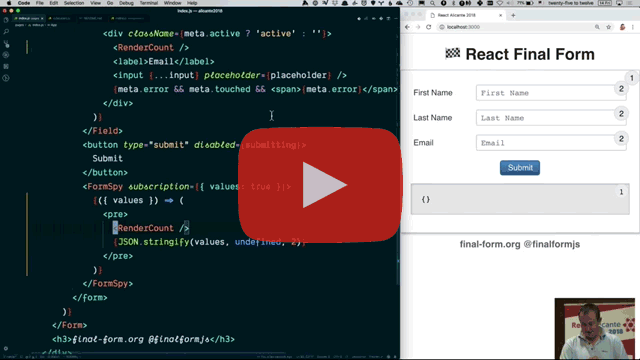

# 🏁 React Final Form


[](#backers) [](#sponsors) [](https://www.npmjs.com/package/react-final-form)
[](https://www.npmjs.com/package/react-final-form)
[](https://travis-ci.org/final-form/react-final-form)
[](https://codecov.io/gh/final-form/react-final-form)
[](https://github.com/prettier/prettier)

✅ Zero dependencies

✅ Only peer dependencies: React and
[🏁 Final Form](https://github.com/final-form/final-form#-final-form)

✅ Opt-in subscriptions - only update on the state you need!

✅ 💥 [**2.9k gzipped**](https://bundlephobia.com/result?p=react-final-form) 💥

---

## 💬 [Give Feedback on React Final Form](https://goo.gl/forms/dxdfxKNy64DLb99z2) 💬

In the interest of making 🏁 React Final Form the best library it can be, we'd love your thoughts and feedback.

[Take a quick survey](https://goo.gl/forms/dxdfxKNy64DLb99z2).

---

## Installation

```bash
npm install --save react-final-form final-form
```

or

```bash
yarn add react-final-form final-form
```

## Getting Started

🏁 React Final Form is a thin React wrapper for 🏁 Final Form, which is a
subscriptions-based form state management library that uses the
[Observer pattern](https://en.wikipedia.org/wiki/Observer_pattern), so only the
components that need updating are re-rendered as the form's state changes. By
default, 🏁 React Final Form subscribes to _all_ changes, but if you want to
fine tune your form to optimized blazing-fast perfection, you may specify only
the form state that you care about for rendering your gorgeous UI.

You can think of it a little like GraphQL's feature of only fetching the data
your component needs to render, and nothing else.

Here's what it looks like in your code:

```jsx
import { Form, Field } from 'react-final-form'

const MyForm = () => (
  <Form
    onSubmit={onSubmit}
    validate={validate}
    render={({ handleSubmit, pristine, invalid }) => (
      <form onSubmit={handleSubmit}>
        <h2>Simple Default Input</h2>
        <div>
          <label>First Name</label>
          <Field name="firstName" component="input" placeholder="First Name" />
        </div>

        <h2>An Arbitrary Reusable Input Component</h2>
        <div>
          <label>Interests</label>
          <Field name="interests" component={InterestPicker} />
        </div>

        <h2>Render Function</h2>
        <Field
          name="bio"
          render={({ input, meta }) => (
            <div>
              <label>Bio</label>
              <textarea {...input} />
              {meta.touched && meta.error && <span>{meta.error}</span>}
            </div>
          )}
        />

        <h2>Render Function as Children</h2>
        <Field name="phone">
          {({ input, meta }) => (
            <div>
              <label>Phone</label>
              <input type="text" {...input} placeholder="Phone" />
              {meta.touched && meta.error && <span>{meta.error}</span>}
            </div>
          )}
        </Field>

        <button type="submit" disabled={pristine || invalid}>
          Submit
        </button>
      </form>
    )}
  />
)
```

## Table of Contents

<!-- START doctoc generated TOC please keep comment here to allow auto update -->
<!-- DON'T EDIT THIS SECTION, INSTEAD RE-RUN doctoc TO UPDATE -->
<!-- DON'T EDIT THIS SECTION, INSTEAD RE-RUN doctoc TO UPDATE -->

- [Videos](#videos)
- [Examples](#examples)
  - [Simple Example](#simple-example)
  - [Synchronous Record-Level Validation](#synchronous-record-level-validation)
  - [Synchronous Field-Level Validation](#synchronous-field-level-validation)
  - [Asynchronous Field-Level Validation](#asynchronous-field-level-validation)
  - [Hybrid Synchronous/Asynchronous Record-Level Validation](#hybrid-synchronousasynchronous-record-level-validation)
  - [Submission Errors](#submission-errors)
  - [Third Party Components](#third-party-components)
  - [Material-UI 1.0](#material-ui-10)
  - [💥 Performance Optimization Through Subscriptions 💥](#-performance-optimization-through-subscriptions-)
  - [Independent Error Component](#independent-error-component)
  - [Loading and Initializing Values](#loading-and-initializing-values)
  - [Field Arrays](#field-arrays)
  - [Calculated Fields](#calculated-fields)
  - [Field Warnings](#field-warnings)
  - [Reusable Field Groups](#reusable-field-groups)
  - [External Submit](#external-submit)
  - [Wizard Form](#wizard-form)
  - [Parse and Format (and Normalize)](#parse-and-format-and-normalize)
  - [Auto-Save with Debounce](#auto-save-with-debounce)
  - [Auto-Save on Field Blur](#auto-save-on-field-blur)
  - [Custom Validation Engine](#custom-validation-engine)
  - [Loading, Normalizing, Saving, and Reinitializing](#loading-normalizing-saving-and-reinitializing)
  - [🏎️ Downshift Type-Ahead](#-downshift-type-ahead)
  - [Redux Example](#redux-example)
  - [Conditional Fields](#conditional-fields)
  - [Listening for External Changes](#listening-for-external-changes)
  - [Focus On First Error](#focus-on-first-error)
  - [Credit Card Example](#credit-card-example)
  - [Async Redux Submission](#async-redux-submission)
  - [Declarative Form Rules](#declarative-form-rules)
  - [Format String By Pattern](#format-string-by-pattern)
  - [AsyncTypeahead and Redux](#asynctypeahead-and-redux)
  - [Format On Blur](#format-on-blur)
  - [Styling with 🍭 Smooth-UI](#styling-with--smooth-ui)
- [Rendering](#rendering)
- [API](#api)
  - [`Field : React.ComponentType<FieldProps>`](#field--reactcomponenttypefieldprops)
  - [`Form : React.ComponentType<FormProps>`](#form--reactcomponenttypeformprops)
  - [`FormSpy : React.ComponentType<FormSpyProps>`](#formspy--reactcomponenttypeformspyprops)
  - [`version: string`](#version-string)
- [Types](#types)
  - [`FieldProps`](#fieldprops)
    - [`allowNull?: boolean`](#allownull-boolean)
    - [`children?: ((props: FieldRenderProps) => React.Node) | React.Node`](#children-props-fieldrenderprops--reactnode--reactnode)
    - [`component?: React.ComponentType<FieldRenderProps> | string`](#component-reactcomponenttypefieldrenderprops--string)
    - [`format?: ((value: any, name: string) => any) | null`](#format-value-any-name-string--any--null)
    - [`formatOnBlur?: boolean`](#formatonblur-boolean)
    - [`isEqual?: (a: any, b: any) => boolean`](#isequal-a-any-b-any--boolean)
    - [`name: string`](#name-string)
    - [`parse?: ((value: any, name: string) => any) | null`](#parse-value-any-name-string--any--null)
    - [`render?: (props: FieldRenderProps) => React.Node`](#render-props-fieldrenderprops--reactnode)
    - [`subscription?: FieldSubscription`](#subscription-fieldsubscription)
    - [`validate?: (value: ?any, allValues: Object, meta: FieldState) => ?any`](#validate-value-any-allvalues-object--any)
    - [`validateFields?: string[]`](#validatefields-string)
    - [`value?: any`](#value-any)
  - [`FieldRenderProps`](#fieldrenderprops)
    - [`input.name: string`](#inputname-string)
    - [`input.onBlur: (?SyntheticFocusEvent<*>) => void`](#inputonblur-syntheticfocusevent--void)
    - [`input.onChange: (SyntheticInputEvent<*> | any) => void`](#inputonchange-syntheticinputevent--any--void)
    - [`input.onFocus: (?SyntheticFocusEvent<*>) => void`](#inputonfocus-syntheticfocusevent--void)
    - [`input.value: any`](#inputvalue-any)
    - [`meta.active?: boolean`](#metaactive-boolean)
    - [`meta.data?: Object`](#metadata-object)
    - [`meta.dirty?: boolean`](#metadirty-boolean)
    - [`meta.error?: any`](#metaerror-any)
    - [`meta.initial?: any`](#metainitial-any)
    - [`meta.invalid?: boolean`](#metainvalid-boolean)
    - [`meta.pristine?: boolean`](#metapristine-boolean)
    - [`meta.submitError?: any`](#metasubmiterror-any)
    - [`meta.submitFailed?: boolean`](#metasubmitfailed-boolean)
    - [`meta.submitSucceeded?: boolean`](#metasubmitsucceeded-boolean)
    - [`meta.submitting?: boolean`](#metasubmitting-boolean)
    - [`meta.touched?: boolean`](#metatouched-boolean)
    - [`meta.valid?: boolean`](#metavalid-boolean)
    - [`meta.visited?: boolean`](#metavisited-boolean)
  - [`FormProps`](#formprops)
    - [`children?: ((props: FormRenderProps) => React.Node) | React.Node`](#children-props-formrenderprops--reactnode--reactnode)
    - [`component?: React.ComponentType<FormRenderProps>`](#component-reactcomponenttypeformrenderprops)
    - [`debug?: DebugFunction`](#debug-debugfunction)
    - [`decorators?: Decorator[]`](#decorators-decorator)
    - [`initialValues?: Object`](#initialvalues-object)
    - [`initialValuesEqual?: (?Object, ?Object) => boolean`](#initialvaluesequal-object-object--boolean)
    - [`keepDirtyOnReinitialize?: boolean`](#keepdirtyonreinitialize-boolean)
    - [`mutators?: { [string]: Mutator }`](#mutators--string-mutator-)
    - [`onSubmit: (values: Object, form: FormApi, callback: ?(errors: ?Object) => void) => ?Object | Promise<?Object> | void`](#onsubmit-values-object-form-formapi-callback-errors-object--void--object--promiseobject--void)
    - [`render?: (props: FormRenderProps) => React.Node`](#render-props-formrenderprops--reactnode)
    - [`subscription?: FormSubscription`](#subscription-formsubscription)
    - [`validate?: (values: Object) => Object | Promise<Object>`](#validate-values-object--object--promiseobject)
    - [`validateOnBlur?: boolean`](#validateonblur-boolean)
  - [`FormRenderProps`](#formrenderprops)
    - [`batch: (fn: () => void) => void)`](#batch-fn---void--void)
    - [`blur: (name: string) => void`](#blur-name-string--void)
    - [`change: (name: string, value: any) => void`](#change-name-string-value-any--void)
    - [`focus: (name: string) => void`](#focus-name-string--void)
    - [`form: FormApi`](#form-formapi)
    - [`handleSubmit: (?SyntheticEvent<HTMLFormElement>) => void`](#handlesubmit-syntheticeventhtmlformelement--void)
    - [`initialize: (values: Object) => void`](#initialize-values-object--void)
    - [`mutators?: { [string]: Function }`](#mutators--string-function-)
    - [`reset: (newInitialValues?: Object) => void`](#reset-newinitialvalues-object--void)
  - [`FormSpyProps`](#formspyprops)
    - [`children?: ((props: FormSpyRenderProps) => React.Node) | React.Node`](#children-props-formspyrenderprops--reactnode--reactnode)
    - [`component?: React.ComponentType<FormSpyRenderProps>`](#component-reactcomponenttypeformspyrenderprops)
    - [`onChange?: (formState: FormState) => void`](#onchange-formstate-formstate--void)
    - [`render?: (props: FormSpyRenderProps) => React.Node`](#render-props-formspyrenderprops--reactnode)
    - [`subscription?: FormSubscription`](#subscription-formsubscription-1)
  - [`FormSpyRenderProps`](#formspyrenderprops)
    - [`batch: (fn: () => void) => void)`](#batch-fn---void--void-1)
    - [`blur: (name: string) => void`](#blur-name-string--void-1)
    - [`change: (name: string, value: any) => void`](#change-name-string-value-any--void-1)
    - [`focus: (name: string) => void`](#focus-name-string--void-1)
    - [`form: FormApi`](#form-formapi-1)
    - [`initialize: (values: Object) => void`](#initialize-values-object--void-1)
    - [`mutators?: { [string]: Function }`](#mutators--string-function--1)
    - [`reset: (newInitialValues?: Object) => void`](#reset-newinitialvalues-object--void-1)
- [Contributors](#contributors)
- [Backers](#backers)
- [Sponsors](#sponsors)

<!-- END doctoc generated TOC please keep comment here to allow auto update -->

## Videos

| [](https://youtu.be/WoSzy-4mviQ) |
| :---------------------------------------------------------------------------------------------------------------------------------: |
|                              **Next Generation Forms with 🏁 React Final Form – React Alicante 2018**                               |

## Examples

### [Simple Example](https://codesandbox.io/s/ww40y2m595)

Uses the built-in React inputs: `input`, `select`, and `textarea` to build a
form with no validation.

### [Synchronous Record-Level Validation](https://codesandbox.io/s/yk1zx56y5j)

Introduces a whole-record validation function and demonstrates how to display
errors next to fields using child render functions.

### [Synchronous Field-Level Validation](https://codesandbox.io/s/2k054qp40)

Introduces field-level validation functions and demonstrates how to display
errors next to fields using child render functions.

### [Asynchronous Field-Level Validation](https://codesandbox.io/s/wy7z7q5zx5)

Demonstrates how field-level validation rules may be asynchronous (return a
`Promise`), as well as how to show a "validating" spinner during the lifetime of
the `Promise`.

### [Hybrid Synchronous/Asynchronous Record-Level Validation](https://codesandbox.io/s/kl9n295n5)

Demonstrates how you can mix synchronous and asynchronous validation patterns at
the record-level, by returning errors synchronously, and falling back to an
asynchronous call (by returning a `Promise`) if sync validation is passing.

### [Submission Errors](https://codesandbox.io/s/9y9om95lyp)

Demonstrates how to return submission errors from failed submits. Notice that
the `Promise` should _resolve_ to the submission error (not reject). Rejection
is reserved for communications or server exceptions.

### [Third Party Components](https://codesandbox.io/s/40mr0v2r87)

Demonstrates how easy it is to use third party input components. All the third
party component really needs is `value` and `onChange`, but more complex
components can accept things like errors.

### [Material-UI 1.0](https://codesandbox.io/s/2z5y03y81r)

Demonstrates how to use Material-UI 1.0 input components.

### 💥 [Performance Optimization Through Subscriptions](https://codesandbox.io/s/32r824vxy1) 💥

Demonstrates how, by restricting which parts of form state the form component
needs to render, it reduces the number of times the whole form has to rerender.
Yet, if some part of form state is needed inside of it, the
[`FormSpy`](#formspy--reactcomponenttypeformspyprops) component can be used to
attain it.

### [Independent Error Component](https://codesandbox.io/s/xoo3xq654p)

Demonstrates how to make an independent Error component to subscribe to and
display the error for any form field.

### [Loading and Initializing Values](https://codesandbox.io/s/91w9ro3x9o)

Demonstrates how a form can be initialized, after fetching data, by passing in
`initialValues` as a prop.

### [Field Arrays](https://codesandbox.io/s/kx8qv67nk5)

Demostrates how to use the `<FieldArray/>` component, from
[`react-final-form-arrays`](https://github.com/final-form/react-final-form-arrays),
to render an array of inputs, as well as use `push`, `pop`, and `remove`
mutations.

### [Calculated Fields](https://codesandbox.io/s/oq52p6v96y)

Demonstrates how to use the
[`final-form-calculate`](https://github.com/final-form/final-form-calculate)
decorator to achieve realtime field calculations through easily defined rules.

### [Field Warnings](https://codesandbox.io/s/m5qwxpr6o8)

Demonstrates how the power of subscriptions and mutators can be used to build a
warning engine: logic to display a message next to each field that is _not_ an
error that prevents form submission.

### [Reusable Field Groups](https://codesandbox.io/s/8z5jm6x80)

Demonstrates how fields can be grouped into reusable components.

### [External Submit](https://codesandbox.io/s/1y7noyrlmq)

Demonstrates how you can use `document.getElementById()` or a closure to trigger
a submit from outside of the form. For more information, see
[How can I trigger a submit from outside the form?](docs/faq.md#how-can-i-trigger-a-submit-from-outside-my-form)

### [Wizard Form](https://codesandbox.io/s/km2n35kq3v)

Demonstrates how to use 🏁 React Final Form to create a multi-page "wizard"
form, with validation on each page.

### [Parse and Format (and Normalize)](https://codesandbox.io/s/10rzowm323)

Demonstrates how to use 🏁 React Final Form's `parse` and `format` props to control exactly how the data flows from the form state through the input and back to the form state. Notice that you can use `parse` to "normalize" your values.

### [Auto-Save with Debounce](https://codesandbox.io/s/5w4yrpyo7k)

Demonstrates how to use a `FormSpy` component to listen for value changes and automatically submit different values after a debounce period.

### [Auto-Save on Field Blur](https://codesandbox.io/s/7k742qpo36)

Demonstrates how to use a `FormSpy` component to listen for values and active field changes to automatically submit values when fields are blurred.

### [Custom Validation Engine](https://codesandbox.io/s/kxxw4l0p9o)

Demonstrates how incredibly extensible `FormSpy`, the [`setFieldData` mutator](https://github.com/final-form/final-form-set-field-data), and render props are by implementing a custom validation engine completely apart from the built-in validation in 🏁 Final Form, thus allowing for special behaviors, like only validating a single field when that field is blurred.

### [Loading, Normalizing, Saving, and Reinitializing](https://codesandbox.io/s/xr0mvl1904)

Demonstrates how to make a wrapper component to handle loading, normalization of data, saving, and reinitializing of the form, to maintain `pristine`/`dirty` state with saved data.

### [🏎️ Downshift Type-Ahead](https://codesandbox.io/s/qzm43nn2mj)

Demonstrates how to use a [🏎️ Downshift](https://github.com/paypal/downshift) type-ahead component as an input.

### [Redux Example](https://codesandbox.io/s/4xq2qpzw79)

The only reason to keep your 🏁 Final Form form data in Redux is if you need to be able to read it from outside your form. This example demonstrates how to use a `FormSpy` to keep a copy of your form data in the Redux store. Note that the canonical authoritative version of the data still lives in 🏁 Final Form. If you need to _mutate_ your data via dispatching Redux actions, you should probably use [Redux Form](https://redux-form.com).

### [Conditional Fields](https://codesandbox.io/s/lm4p3m92q)

Sometimes you might want to conditionally show or hide some parts of your form depending on values the user has already provided for other form inputs. 🏁 React Final Form makes that very easy to do by creating a `Condition` component out of a `Field` component.

### [Listening for External Changes](https://codesandbox.io/s/3x989zl866)

By wrapping a stateful `ExternalModificationDetector` component in a `Field` component, we can listen for changes to a field's value, and by knowing whether or not the field is active, deduce when a field's value changes due to external influences.

### [Focus On First Error](https://codesandbox.io/s/6174kqr403)

Demonstrates how to incorporate the [🏁 Final Form Focus 🧐](https://github.com/final-form/final-form-focus) decorator to provide this functionality out of the box.

### [Credit Card Example](https://codesandbox.io/s/9y8vkrrx9o)

Demonstrates how to make an awesome credit card UX using [React Credit Cards](https://github.com/amarofashion/react-credit-cards).

### [Async Redux Submission](https://codesandbox.io/s/x71mx66z8w)

Want to use `redux-saga` or `redux-observable` to manage your form submissions? Now you can, using [`react-redux-promise-listener`](https://github.com/erikras/react-redux-promise-listener#react-redux-promise-listener) to convert your dispatched Redux actions into the `Promise` that 🏁 React Final Form is expecting for its `onSubmit` function.

### [Declarative Form Rules](https://codesandbox.io/s/52q597j2p)

What if you could define rules to update fields when other fields change _as components_? This example explores such possibilities. There's also [a Medium post](https://medium.com/@erikras/declarative-form-rules-c5949ea97366) about writing it, and creating a companion library, [`react-final-form-listeners`](https://github.com/final-form/react-final-form-listeners#-react-final-form-listeners).

### [Format String By Pattern](https://codesandbox.io/s/no20p7z3l)

Demonstrates how to use the library `format-string-by-pattern` to create input masks for your 🏁 React Final Form fields.

### [AsyncTypeahead and Redux](https://codesandbox.io/s/5m4w2909k)

Demonstrates creating an `AsyncTypeahead` to select github users, while storing the search results in the redux store and the form state (selected github users) via `react-final-form`. Also makes use of the [`setFieldData` mutator](https://github.com/final-form/final-form-set-field-data).

### [Format On Blur](https://codesandbox.io/s/3rp260ly51)

Demonstrates how to use the `formatOnBlur` prop to postpone the formatting of a form field value until the field loses focus. Very useful for formatting numbers, like currencies.

### [Styling with 🍭 Smooth-UI](https://codesandbox.io/s/40o45po3l4)

Demonstrates how to use the Smooth-UI styling library to make your forms look fabulous! All you really need is a higher order component that adapts The 🍭 Smooth-UI form controls to work with 🏁 React Final Form.

## Rendering

There are three ways to tell `<Form/>` and `<Field/>` what to render:

| Method                          | How it is rendered                                        |
| ------------------------------- | --------------------------------------------------------- |
| `component` prop                | `return React.createElement(this.props.component, props)` |
| `render` prop                   | `return this.props.render(props)`                         |
| a render function as `children` | `return this.props.children(props)`                       |

## API

The following can be imported from `react-final-form`.

### `Field : React.ComponentType<FieldProps>`

A component that takes [`FieldProps`](#fieldprops) and renders an individual
field.

### `Form : React.ComponentType<FormProps>`

A component that takes [`FormProps`](#formprops) and surrounds your entire form.

### `FormSpy : React.ComponentType<FormSpyProps>`

A component that takes [`FormSpyProps`](#formspyprops) and can listen to form
state from inside an optimized `<Form/>`.

### `version: string`

The current used version of 🏁 React Final Form.

---

## Types

### `FieldProps`

These are props that you pass to
[`<Field/>`](#field--reactcomponenttypefieldprops). You must provide one of the
ways to render: `component`, `render`, or `children`.

#### `allowNull?: boolean`

By default, if your value is `null`, `<Field/>` will convert it to `''`, to
ensure
[controlled inputs](https://reactjs.org/docs/forms.html#controlled-components).
But if you pass `true` to `allowNull`, `<Field/>` will give you a `null` value.
Defaults to `false`.

#### `children?: ((props: FieldRenderProps) => React.Node) | React.Node`

A render function that is given [`FieldRenderProps`](#fieldrenderprops), as well
as any non-API props passed into the `<Field/>` component.

#### `component?: React.ComponentType<FieldRenderProps> | string`

A component that is given [`FieldRenderProps`](#fieldrenderprops) as props, as
well as any non-API props passed into the `<Field/>` component.

#### `format?: ((value: any, name: string) => any) | null`

A function that takes the value from the form values and the name of the field and formats the value to give to the input. Common use cases include converting javascript `Date` values into a localized date string. Almost always used in conjunction with `parse`.

**Note: If you pass `null` to `format`, it will override the default behavior of converting `undefined` into `''`. If you do this, making sure your inputs are "controlled" is up to you.**

#### `formatOnBlur?: boolean`

If `true`, the `format` function will only be called when the field is blurred. If `false`, `format` will be called on every render. Defaults to `false`.

#### `isEqual?: (a: any, b: any) => boolean`

[See the 🏁 Final Form docs on `isEqual`](https://github.com/final-form/final-form#isequal-a-any-b-any--boolean).

#### `name: string`

The name of your field. Field values may be deeply nested using dot-and-bracket syntax. [Learn more about Field Names](https://github.com/final-form/final-form#field-names).

#### `parse?: ((value: any, name: string) => any) | null`

A function that takes the value from the input and name of the field and converts the value into the value you want stored as this field's value in the form. Common usecases include converting strings into `Number`s or parsing localized dates into actual javascript `Date` objects. Almost always used in conjuction with `format`.

**Note: If you pass `null` to `parse`, it will override the default behavior of converting `''` into `undefined`, thus allowing you to have form values of `''`.**

#### `render?: (props: FieldRenderProps) => React.Node`

A render function that is given [`FieldRenderProps`](#fieldrenderprops), as well
as any non-API props passed into the `<Field/>` component.

#### `subscription?: FieldSubscription`

A
[`FieldSubscription`](https://github.com/final-form/final-form#fieldsubscription--string-boolean-)
that selects all of the items of
[`FieldState`](https://github.com/final-form/final-form#fieldstate) that you
wish to update for. If you don't pass a `subscription` prop, it defaults to
_all_ of [`FieldState`](https://github.com/final-form/final-form#fieldstate).

#### `validate?: (value: ?any, allValues: Object, meta: FieldState) => ?any`

A function that takes the field value, all the values of the form and the `meta` data about the field and
returns an error if the value is invalid, or `undefined` if the value is valid.

#### `validateFields?: string[]`

[See the 🏁 Final Form docs on `validateFields`](https://github.com/final-form/final-form#validatefields-string).

#### `value?: any`

**This is only used for checkboxes and radio buttons!**

- Radio Buttons: The value of the radio button. The radio button will render as `checked` if and only if the value given here `===` the value for the field in the form.
- Checkboxes:
  - `value` is specified: the checkbox will be `checked` if the value given in `value` is contained in the array that is the value for the field for the form. Checking the box will add the value to the array, and unchecking the checkbox will remove the value from the array.
  - no `value` is specified: the checkbox will be `checked` if the value is truthy. Checking the box will set the value to `true`, and unchecking the checkbox will set the value to `false`.

### `FieldRenderProps`

These are the props that [`<Field/>`](#field--reactcomponenttypefieldprops)
provides to your render function or component. This object separates out the
values and event handlers intended to be given to the input component from the
`meta` data about the field. The `input` can be destructured directly into an
`<input/>` like so: `<input {...props.input}/>`. Keep in mind that **the values
in `meta` are dependent on you having subscribed to them** with the
[`subscription` prop](#subscription-fieldsubscription)

#### `input.name: string`

The name of the field.

#### `input.onBlur: (?SyntheticFocusEvent<*>) => void`

The `onBlur` function can take a `SyntheticFocusEvent` like it would if you had
given it directly to an `<input/>` component, but you can also just call it:
`props.input.onBlur()` to mark the field as blurred (inactive).

#### `input.onChange: (SyntheticInputEvent<*> | any) => void`

The `onChange` function can take a `SyntheticInputEvent` like it would if you
had given it directly to an `<input/>` component (in which case it will read the
value out of `event.target.value`), but you can also just call it:
`props.input.onChange(value)` to update the value of the field.

#### `input.onFocus: (?SyntheticFocusEvent<*>) => void`

The `onFocus` function can take a `SyntheticFocusEvent` like it would if you had
given it directly to an `<input/>` component, but you can also just call it:
`props.input.onFocus()` to mark the field as focused (active).

#### `input.value: any`

The current value of the field.

#### `meta.active?: boolean`

[See the 🏁 Final Form docs on `active`](https://github.com/final-form/final-form#active-boolean).

#### `meta.data?: Object`

[See the 🏁 Final Form docs on `data`](https://github.com/final-form/final-form#data-object).

#### `meta.dirty?: boolean`

[See the 🏁 Final Form docs on `dirty`](https://github.com/final-form/final-form#dirty-boolean).

#### `meta.error?: any`

[See the 🏁 Final Form docs on `error`](https://github.com/final-form/final-form#error-any).

#### `meta.initial?: any`

[See the 🏁 Final Form docs on `initial`](https://github.com/final-form/final-form#initial-any).

#### `meta.invalid?: boolean`

[See the 🏁 Final Form docs on `invalid`](https://github.com/final-form/final-form#invalid-boolean).

#### `meta.pristine?: boolean`

[See the 🏁 Final Form docs on `pristine`](https://github.com/final-form/final-form#pristine-boolean).

#### `meta.submitError?: any`

[See the 🏁 Final Form docs on `submitError`](https://github.com/final-form/final-form#submiterror-any).

#### `meta.submitFailed?: boolean`

[See the 🏁 Final Form docs on `submitFailed`](https://github.com/final-form/final-form#submitfailed-boolean).

#### `meta.submitSucceeded?: boolean`

[See the 🏁 Final Form docs on `submitSucceeded`](https://github.com/final-form/final-form#submitsucceeded-boolean).

#### `meta.submitting?: boolean`

[See the 🏁 Final Form docs on `submitting`](https://github.com/final-form/final-form#submitting-boolean).

#### `meta.touched?: boolean`

[See the 🏁 Final Form docs on `touched`](https://github.com/final-form/final-form#touched-boolean).

#### `meta.valid?: boolean`

[See the 🏁 Final Form docs on `valid`](https://github.com/final-form/final-form#valid-boolean).

#### `meta.visited?: boolean`

[See the 🏁 Final Form docs on `visited`](https://github.com/final-form/final-form#visited-boolean).

### `FormProps`

These are the props that you pass to
[`<Form/>`](#form--reactcomponenttypeformprops). You must provide one of the
ways to render: `component`, `render`, or `children`.

#### `children?: ((props: FormRenderProps) => React.Node) | React.Node`

A render function that is given [`FormRenderProps`](#formrenderprops), as well
as any non-API props passed into the `<Form/>` component.

#### `component?: React.ComponentType<FormRenderProps>`

A component that is given [`FormRenderProps`](#formrenderprops) as props, as
well as any non-API props passed into the `<Form/>` component.

#### `debug?: DebugFunction`

[See the 🏁 Final Form docs on `debug`](https://github.com/final-form/final-form#debug-debugfunction).

#### `decorators?: Decorator[]`

[`Decorator`](https://github.com/final-form/final-form#decorator-form-formapi--unsubscribe)s
to apply to the form.

#### `initialValues?: Object`

[See the 🏁 Final Form docs on `initialValues`](https://github.com/final-form/final-form#initialvalues-object).

#### `initialValuesEqual?: (?Object, ?Object) => boolean`

A predicate to determine whether or not the `initialValues` prop has changed. Useful for passing in a "deep equals" function if you need to. Defaults to "shallow equals".

#### `keepDirtyOnReinitialize?: boolean`

[See the 🏁 Final Form docs on `keepDirtyOnReinitialize`](https://github.com/final-form/final-form#keepdirtyonreinitialize-boolean).

#### `mutators?: { [string]: Mutator }`

[See the 🏁 Final Form docs on `mutators`](https://github.com/final-form/final-form#mutators--string-function-).

#### `onSubmit: (values: Object, form: FormApi, callback: ?(errors: ?Object) => void) => ?Object | Promise<?Object> | void`

[See the 🏁 Final Form docs on `onSubmit`](https://github.com/final-form/final-form#onsubmit-values-object-form-formapi-callback-errors-object--void--object--promiseobject--void).

#### `render?: (props: FormRenderProps) => React.Node`

A render function that is given [`FormRenderProps`](#formrenderprops), as well
as any non-API props passed into the `<Form/>` component.

#### `subscription?: FormSubscription`

A
[`FormSubscription`](https://github.com/final-form/final-form#formsubscription--string-boolean-)
that selects all of the items of
[`FormState`](https://github.com/final-form/final-form#formstate) that you wish
to update for. If you don't pass a `subscription` prop, it defaults to _all_ of
[`FormState`](https://github.com/final-form/final-form#formstate).

#### `validate?: (values: Object) => Object | Promise<Object>`

[See the 🏁 Final Form docs on `validate`](https://github.com/final-form/final-form#validate-values-object--object--promiseobject).

#### `validateOnBlur?: boolean`

[See the 🏁 Final Form docs on `validateOnBlur`](https://github.com/final-form/final-form#validateonblur-boolean).

### `FormRenderProps`

These are the props that [`<Form/>`](#form--reactcomponenttypeformprops)
provides to your render function or component. Keep in mind that the values you
receive here are dependent upon which values of
[`FormState`](https://github.com/final-form/final-form#formstate) you have
subscribed to with the
[`subscription` prop](https://github.com/final-form/react-final-form#subscription-formsubscription).
This object contains everything in
[🏁 Final Form's `FormState`](https://github.com/final-form/final-form#formstate)
as well as:

#### `batch: (fn: () => void) => void)`

_**[DEPRECATED]** Use `form.batch()` instead_

A function that allows batch updates to be done to the form state.
[See the 🏁 Final Form docs on `batch`](https://github.com/final-form/final-form#batch-fn---void--void).

#### `blur: (name: string) => void`

_**[DEPRECATED]** Use `form.blur()` instead_

A function to blur (mark inactive) any field.

#### `change: (name: string, value: any) => void`

_**[DEPRECATED]** Use `form.change()` instead_

A function to change the value of any field.

#### `focus: (name: string) => void`

_**[DEPRECATED]** Use `form.focus()` instead_

A function to focus (mark active) any field.

#### `form: FormApi`

The 🏁 Final Form [`FormApi`](https://github.com/final-form/final-form#formapi).

#### `handleSubmit: (?SyntheticEvent<HTMLFormElement>) => void`

A function intended for you to give directly to the `<form>` tag: `<form onSubmit={handleSubmit}/>`.

#### `initialize: (values: Object) => void`

_**[DEPRECATED]** Use `form.initialize()` instead_

A function that initializes the form values.
[See the 🏁 Final Form docs on `initialize`](https://github.com/final-form/final-form#initialize-values-object--void).

#### `mutators?: { [string]: Function }`

_**[DEPRECATED]** Use `form.mutators` instead_

[See the 🏁 Final Form docs on `mutators`](https://github.com/final-form/final-form#mutators--string-function-).

#### `reset: (newInitialValues?: Object) => void`

_**[DEPRECATED]** Use `form.reset()` instead_

A function that resets the form values to their last initialized values.
[See the 🏁 Final Form docs on `reset`](https://github.com/final-form/final-form#reset-initialvalues-object--void).

### `FormSpyProps`

These are the props that you pass to
[`<FormSpy/>`](#formspy--reactcomponenttypeformspyprops). You must provide one
of the ways to render: `component`, `render`, or `children`.

#### `children?: ((props: FormSpyRenderProps) => React.Node) | React.Node`

A render function that is given [`FormSpyRenderProps`](#formspyrenderprops), as
well as any non-API props passed into the `<FormSpy/>` component. Will not be
called if an `onChange` prop is provided.

#### `component?: React.ComponentType<FormSpyRenderProps>`

A component that is given [`FormSpyRenderProps`](#formspyrenderprops) as props,
as well as any non-API props passed into the `<FormSpy/>` component. Will not be
called if an `onChange` prop is provided.

#### `onChange?: (formState: FormState) => void`

A change listener that will be called with form state whenever the form state,
as subscribed to by the `subscription` prop, has changed. When an `onChange`
prop is provided, the `<FormSpy/>` will not render anything.

#### `render?: (props: FormSpyRenderProps) => React.Node`

A render function that is given [`FormSpyRenderProps`](#formspyrenderprops), as
well as any non-API props passed into the `<FormSpy/>` component. Will not be
called if an `onChange` prop is provided.

#### `subscription?: FormSubscription`

A
[`FormSubscription`](https://github.com/final-form/final-form#formsubscription--string-boolean-)
that selects all of the items of
[`FormState`](https://github.com/final-form/final-form#formstate) that you wish
to update for. If you don't pass a `subscription` prop, it defaults to _all_ of
[`FormState`](https://github.com/final-form/final-form#formstate).

### `FormSpyRenderProps`

These are the props that
[`<FormSpy/>`](#formspy--reactcomponenttypeformspyprops) provides to your render
function or component. These props are of type
[`FormState`](https://github.com/final-form/final-form#formstate). Keep in mind
that the values you receive here are dependent upon which values of
[`FormState`](https://github.com/final-form/final-form#formstate) you have
subscribed to with the
[`subscription` prop](https://github.com/final-form/react-final-form#subscription-formsubscription). Also included will be many of the same props provided to [`FormRenderProps`](#formrenderprops):

#### `batch: (fn: () => void) => void)`

_**[DEPRECATED]** Use `form.batch()` instead_

A function that allows batch updates to be done to the form state.
[See the 🏁 Final Form docs on `batch`](https://github.com/final-form/final-form#batch-fn---void--void).

#### `blur: (name: string) => void`

_**[DEPRECATED]** Use `form.blur()` instead_

A function to blur (mark inactive) any field.

#### `change: (name: string, value: any) => void`

_**[DEPRECATED]** Use `form.change()` instead_

A function to change the value of any field.

#### `focus: (name: string) => void`

_**[DEPRECATED]** Use `form.focus()` instead_

A function to focus (mark active) any field.

#### `form: FormApi`

The 🏁 Final Form [`FormApi`](https://github.com/final-form/final-form#formapi).

#### `initialize: (values: Object) => void`

_**[DEPRECATED]** Use `form.initialize()` instead_

A function that initializes the form values.
[See the 🏁 Final Form docs on `initialize`](https://github.com/final-form/final-form#initialize-values-object--void).

#### `mutators?: { [string]: Function }`

_**[DEPRECATED]** Use `form.mutators` instead_

[See the 🏁 Final Form docs on `mutators`](https://github.com/final-form/final-form#mutators--string-function-).

#### `reset: (newInitialValues?: Object) => void`

_**[DEPRECATED]** Use `form.reset()` instead_

A function that resets the form values to their last initialized values.
[See the 🏁 Final Form docs on `reset`](https://github.com/final-form/final-form#reset-initialvalues-object--void).

## Contributors

This project exists thanks to all the people who contribute. [[Contribute](.github/CONTRIBUTING.md)].
<a href="https://github.com/final-form/react-final-form/graphs/contributors"></a>

## Backers

Thank you to all our backers! 🙏 [[Become a backer](https://opencollective.com/final-form#backer)]

<a href="https://opencollective.com/final-form#backers" target="_blank"></a>

## Sponsors

Support this project by becoming a sponsor. Your logo will show up here with a link to your website. [[Become a sponsor](https://opencollective.com/final-form#sponsor)]

<a href="https://opencollective.com/final-form/sponsor/0/website" target="_blank"></a>
<a href="https://opencollective.com/final-form/sponsor/1/website" target="_blank"></a>
<a href="https://opencollective.com/final-form/sponsor/2/website" target="_blank"></a>
<a href="https://opencollective.com/final-form/sponsor/3/website" target="_blank"></a>
<a href="https://opencollective.com/final-form/sponsor/4/website" target="_blank"></a>
<a href="https://opencollective.com/final-form/sponsor/5/website" target="_blank"></a>
<a href="https://opencollective.com/final-form/sponsor/6/website" target="_blank"></a>
<a href="https://opencollective.com/final-form/sponsor/7/website" target="_blank"></a>
<a href="https://opencollective.com/final-form/sponsor/8/website" target="_blank"></a>
<a href="https://opencollective.com/final-form/sponsor/9/website" target="_blank"></a>
